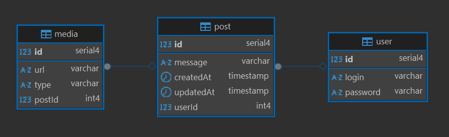

# Тестовое задание для разработчика Node.js | WelbeX

## 🛠️ Технологии

### Клиент:

- ⚛️ **React**
- 🟦 **TypeScript**
- ⚡ **Vite**
- 🎨 **MUI**
- 📦 **TanStack Query**
- 🧠 **Zustand**

### Сервер:

- 🏗️ **Express.js**
- 🟦 **TypeScript**
- ⚙️ **TypeORM**

### База данных:

- 🐘 **PostgreSQL**

#### Схема:

## Локальное тестирование

1. Можно запускать локально через терминал
2. Приложение упаковано в докер, так что можно запускать через него

## 🌐 Деплой

- **Фронтенд:**  
  [welbex-test-task-client.onrender.com](https://welbex-test-task-client.onrender.com)

- **Swagger-документация API:**  
  [welbex-test-task-8b0s.onrender.com/api-docs](https://welbex-test-task-8b0s.onrender.com/api-docs)

## Итого:

В общем и целом, реализованы все задания из ТЗ, но баги тоже присутствуют 💀
